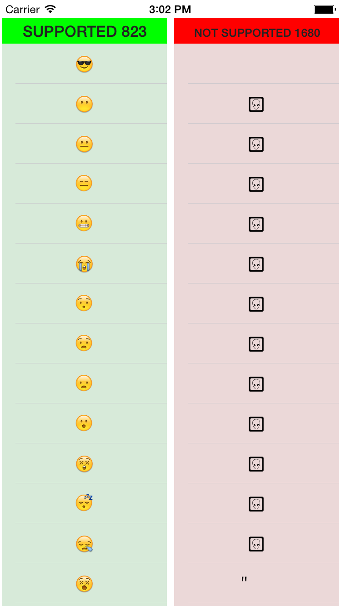
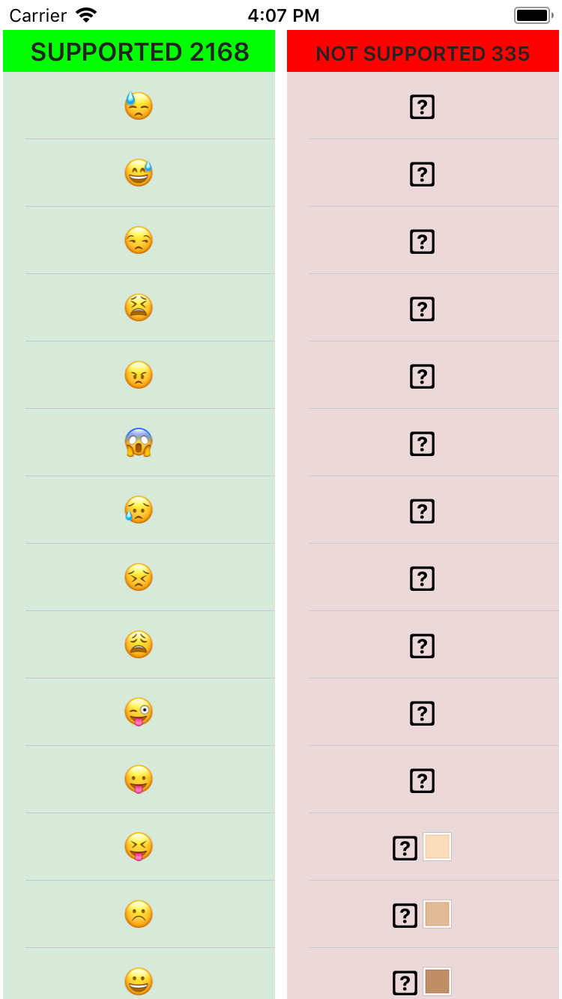
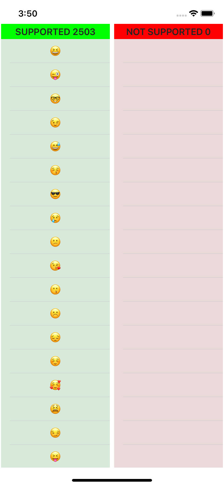

# NSString-isEmoji

## Features
* Does not use UILabel - can run on background
* Does not use Character() - no crashes on old iOS version

||||
| --- | --- | --- |
|iOS 8.1|iOS 11.0.1|iOS 12.1|

### Run the Example to try
